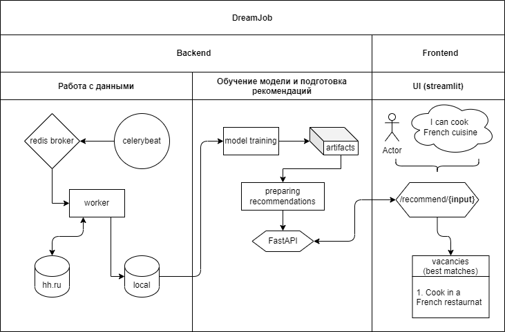

# DreamJob
Пет-проект для поиска вакансий по запросу пользователя. Просто опиши
чем тебе хотелось бы заниматься, какие скиллы и увлечения у тебя есть,
и алгоритм подберет для тебя best-match вакансии.

Tech: python, celery, redis, FastAPI, SQL, streamlit.

## Схема проекта

### Работа с данными

При рекомендации вакансий важно, чтобы они были актуальными, в связи 
с чем возникает необходимость постоянно обновлять нашу базу данных с 
вакансиями. Помимо этого, желательно, чтобы процесс парсинга данных и
ее загрузки в БД не мешал основной функциональности сервиса, то есть
работал в фоновом режиме. Все эти проблемы прекрасно решает celery -
инструмент для управления очередями задач.

Как это устроено на примере данного проекта. У нас есть celerybeat - 
это планировщик, который отправляет сообщения с задачей выгрузить 
данные по вакансиями с hh.ru и загрузить их в локальную БД, 
на выполнение нашему брокеру (redis). 
Сообщения отправляются ежедневно в одно и то же время. 
Брокер принимает сообщение с задачами и распределяет их между 
воркерами (в нашем случай количество воркеров одно), 
то есть брокер выступает в качестве централизованной системы. 
Воркер принимает сообщение и выполняет задачу отдельно 
от основного функционала проекта.

Таким образом, наша БД постоянно обновляется, при этом не мешаяя 
основному функционалу. Более того, в случае если при выполнении таких
задач выкинет ошибку, сам сервис не упадет.

### Обучение модели и подготовка рекоменаций

Логика рекомендаций вакансий заключается в сравнении запроса 
пользователя с описаниями вакансий. Для решения этой задачи будут
использованы следующие алгоритмы: tf-idf, sentence-bert. В проект
пока внедрен только tf-idf. 

И так, используя данные, которые мы периодически обновляем с помощью 
celery, обучается модель. Обучение модели происходит пока в отдельном 
ноутбуке (в будущем, будет также реализован как celery task). 
Саму модель и ее артифакты сохраняем для эффективности работы во время
рекомендаций в онлайне. 

Связь backend'а с frontend'ом проходит благодаря api, реализованного 
с помощью FastAPI. В проекте только одна функция - рекомендация
вакансий, соответсвенно для нее и реализован один endpoint.

### Frontend с помощью streamlit

Интрефейс приложения реализован с помощью streamlit. Очень удобный 
фреймворк для создания ml и ds проектов. 
